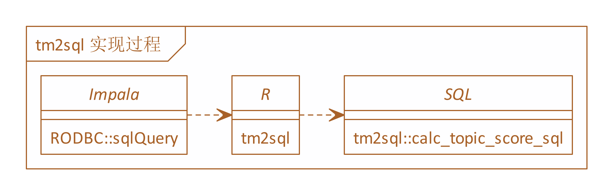

<!-- README.md is generated from README.Rmd. Please edit that file -->

# tm2sql

<!-- badges: start -->

<!-- badges: end -->

The goal of tm2sql is to translate topic model into SQL. I use it into
production by impala successfully.



## Installation

The development version from [GitHub](https://github.com/) with:

``` r
# install.packages("devtools")
devtools::install_github("JiaxiangBU/tm2sql")
```

## Example

This is a basic example which shows you how to solve a common problem:

``` r
library(tm2sql)
library(tidyverse)
#> -- Attaching packages ------------------------------------------------------------------------------- tidyverse 1.2.1 --
#> √ ggplot2 3.2.0     √ purrr   0.3.2
#> √ tibble  2.1.3     √ dplyr   0.8.2
#> √ tidyr   0.8.3     √ stringr 1.4.0
#> √ readr   1.3.1     √ forcats 0.4.0
#> Warning: package 'ggplot2' was built under R version 3.5.3
#> Warning: package 'tibble' was built under R version 3.5.3
#> Warning: package 'tidyr' was built under R version 3.5.3
#> Warning: package 'purrr' was built under R version 3.5.3
#> Warning: package 'dplyr' was built under R version 3.5.3
#> Warning: package 'stringr' was built under R version 3.5.3
#> Warning: package 'forcats' was built under R version 3.5.3
#> -- Conflicts ---------------------------------------------------------------------------------- tidyverse_conflicts() --
#> x dplyr::filter() masks stats::filter()
#> x dplyr::lag()    masks stats::lag()
## basic example code
```

``` r
beta_df <- data.frame(dict = c("文本", "分析", "学习", "笔记"),
                      loading = c(0.1, 0.2, 0.3, 0.4))
calc_topic_score_sql(beta_df, dict, loading)
#>   dict loading
#> 1 文本     0.1
#> 2 分析     0.2
#> 3 学习     0.3
#> 4 笔记     0.4
#>                                                          sql_text
#> 1 0.1 * length(regexp_replace(文本, "[^测试]",""))/length("测试")
#> 2 0.2 * length(regexp_replace(分析, "[^测试]",""))/length("测试")
#> 3 0.3 * length(regexp_replace(学习, "[^测试]",""))/length("测试")
#> 4 0.4 * length(regexp_replace(笔记, "[^测试]",""))/length("测试")
#> 0.1 * length(regexp_replace(文本, "[^测试]",""))/length("测试") + 
#> 0.2 * length(regexp_replace(分析, "[^测试]",""))/length("测试") + 
#> 0.3 * length(regexp_replace(学习, "[^测试]",""))/length("测试") + 
#> 0.4 * length(regexp_replace(笔记, "[^测试]",""))/length("测试")
```

-----

<h4 align="center">

**Code of Conduct**

</h4>

<h6 align="center">

Please note that the `tm2sql` project is released with a [Contributor
Code of Conduct](.github/CODE_OF_CONDUCT.md).<br>By contributing to this
project, you agree to abide by its terms.

</h6>

<h4 align="center">

**License**

</h4>

<h6 align="center">

MIT © [Jiaxiang Li](LICENSE.md)

</h6>
